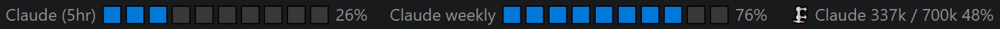
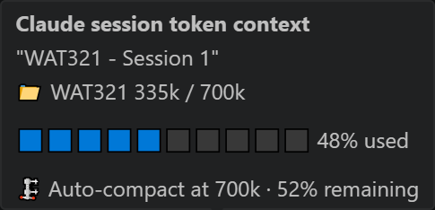
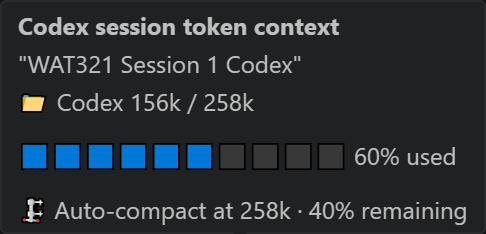

# WAT321 — Willy's AI Tools 3-2-1

*Tired of the anxiety from manually refreshing Claude's usage limits? Now you can live in anxiety in real-time!*

Real-time AI usage widgets for your VS Code status bar.

### What you get out of the box

WAT321 ships with **six status bar widgets** for Claude and Codex — Claude tools are visible by default, Codex tools are installed but hidden. Turn them on in two clicks.

---

## What's Included

### Claude Usage (5h + Weekly)

Live progress bars showing your 5-hour session utilization and weekly limits. Simple hover for information breakdown.

### Claude Session Tokens

Tracks your active Claude Code session's context window usage against the auto-compact ceiling. See how much room you have before compaction kicks in.

### Codex Usage (5 hour + Weekly)

Same concept, green bars for Codex. Shows remaining capacity — the bars deplete as you use more.

### Codex Session Tokens

Monitors your Codex session's context window fill level. Same layout as Claude session tokens.

---

## Enabling Codex Widgets

All six tools install together, but only Claude widgets are visible by default. To turn on Codex:

1. Click the **status bar overflow button** (the `>>` icon at the bottom-right of VS Code)

2. Check the **WAT321: Codex** items you want to see

That's it. Your selections persist across sessions.

---

## How It Works

- **Claude Usage** and **Codex Usage** poll their respective APIs on a safe interval (~2 minutes) with built-in rate-limit protection
- **Session Tokens** (both providers) read local transcript files — no API calls, no network access
- All data sources are **read-only** — WAT321 never modifies any user files or credentials
- One shared API polling path per provider prevents duplicate calls even with multiple widgets active

## What It Doesn't Do

- WAT321 does not store, transmit, or modify your credentials
- WAT321 does not make API calls on your behalf (beyond reading usage stats)
- WAT321 does not interfere with Claude Code, Codex CLI, or any other extension

## Requirements

- VS Code 1.85.0 or later
- Claude widgets need an active Claude account with CLI credentials (`~/.claude/.credentials.json`)
- Codex widgets need Codex CLI credentials (`~/.codex/auth.json`)
- Session token widgets need an active session in the respective CLI tool

## Installation

Install from a `.vsix` file:
1. Download `wat321-x.x.x.vsix`
2. Open VS Code, press `Ctrl+Shift+P`, type **Extensions: Install from VSIX**
3. Select the file and reload

Widgets appear in the status bar automatically. Toggle visibility by right-clicking the status bar.

## Supported Plans

| Provider | Plan | Status |
|----------|------|--------|
| Claude | Max (5x / 10x / 20x) | Supported — plan tier detected automatically |
| Claude | Pro | Supported — usage data works, plan label not shown |
| Claude | Free | Supported — usage data works, plan label not shown |
| Claude | Team / Enterprise | Unknown — untested with the usage API |
| Codex | Plus / Pro / Team | Supported |

API-only Anthropic accounts without CLI OAuth credentials will see the Claude widgets hidden, which is expected.

## Rate Limits

Both Claude and Codex usage APIs have rate limits. WAT321 polls conservatively to stay well within safe thresholds. However, **repeatedly reinstalling, reloading, or enabling/disabling the extension in quick succession can trigger a rate-limit lockout** of approximately 15 minutes.

If a lockout occurs, the status bar will show "Offline" and the tooltip will display a countdown timer. The extension will automatically reconnect when the lockout expires — no action needed.

## License

[MIT](LICENSE)
