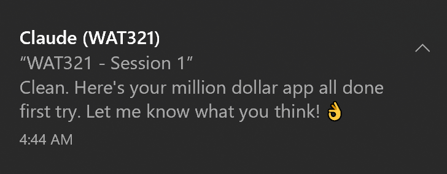
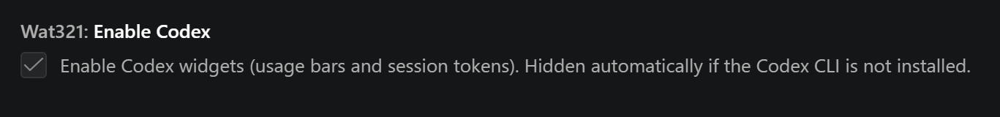

# WAT321 - Willy's AI Tools

### *Does manually refreshing AI usage limits give you anxiety?*

## Now you can live in fear in real-time!

Claude and Codex usage bars built right into your IDE.

WAT321 ships with **six read-only widgets** - three for Claude, three for Codex - all enabled out of the box. They only read your existing CLI files and poll a safe stats endpoint; they never modify anything.

One opt-in **Experimental** setting is also available in the Claude section - see below.

- 4 usage limit progress bars (Claude + Codex, 5-hour and weekly)
- 2 real-time session token status bars
- Heatmap for progress bars - colors warn as limits approach
- System notifications when a response finishes - never miss a reply while tabbed away
- Hover tooltips with the detailed breakdown
- Force Auto-Compact (Experimental, opt-in) for higher-quality compacts than `/compact`
- "Epic Handshake" in development - enables automatic crosstalk between Claude and Codex for epic results (Kick off Claude/Codex as a true ~~sub~~agent on steroids)
- Available on the VS Marketplace, Open VSX Registry, and as a direct `.vsix` download

---

## What's Included

### Claude Usage

Live progress bars showing your 5-hour session utilization and weekly limits. Simple hover for information breakdown.

 

### Claude Session Tokens

Tracks your active Claude Code session's context window usage against the auto-compact ceiling. See how much room you have before compaction kicks in.

### Codex Usage

Same concept, **green** bars for Codex. Shows **remaining** capacity - the bars deplete as you use more.

 

### Codex Session Tokens

Monitors your Codex session's context window fill level. Same layout as Claude session tokens.

### Notifications

Get notified when Claude or Codex finishes a response. Works on Windows, Linux, and macOS.

### Force Claude Auto-Compact *(experimental, off by default)*

An **experimental** checkbox in the Claude settings section. Arms Claude's built-in Auto-Compact so it triggers on your next message prompt. Disarms after 30 seconds of no activity or can be cancelled. Produces a higher-quality compaction result than the manual `/compact` command, preserving tool results and reasoning. This is the only WAT321 tool that writes outside of `~/.wat321/`. Your Claude settings are backed up automatically. *Useful for long sessions when performance degrades.*

---

## Installation

### From the VS Code Marketplace
1. Open VS Code
2. Go to Extensions (`Ctrl+Shift+X` / `Cmd+Shift+X`)
3. Search **"WAT321"**
4. Click **Install**

### From the Open VSX Registry
For VS Code forks and derivatives that use Open VSX instead of the proprietary Marketplace (VSCodium, Cursor, Windsurf, Gitpod, etc.):
1. Open the Extensions view in your editor
2. Search **"WAT321"**
3. Click **Install**

### From a .vsix file
1. `Ctrl+Shift+P` / `Cmd+Shift+P` then **Extensions: Install from VSIX**
2. Select the `.vsix` file
3. Reload window

**Where to find the files:**
- **VS Marketplace** - https://marketplace.visualstudio.com/publishers/WillyDrucker
- **Open VSX Registry** - https://open-vsx.org/extension/WillyDrucker/wat321
- **.vsix downloads** - every release is attached to its [GitHub Release](https://github.com/WillyDrucker/WAT321/releases) as a downloadable asset

---

## Provider Toggles

Both Claude and Codex widgets are enabled by default. If a provider CLI is not installed, its widgets stay hidden automatically. If you want to turn one provider off yourself:

1. **File > Preferences > Settings** (`Ctrl+,` / `Cmd+,`) and search for **"wat321"**
2. Uncheck **Enable Claude** or **Enable Codex** - widgets disappear immediately, no reload needed

 

## Display Modes

WAT321 supports four display densities. Search **"wat321"** in **Settings** and pick the one that fits how crowded you like your status bar.

- **Auto** (default) - automatically picks Full when only one provider is active, Compact when both are active
- **Full** - 10-block progress bars with all details
- **Compact** - 5-block progress bars, session tokens show text only
- **Minimal** - text-only, usage bars move to tooltips on hover

## Customize Visible Widgets

You can show or hide individual widgets by right-clicking the status bar or using the overflow menu (`>>`):

---

## How It Works

### The six read-only widgets (the default core)
- **Claude Usage** and **Codex Usage** poll their respective APIs on a safe interval (~2 minutes) with built-in rate-limit protection
- **Session Tokens** (both providers) read local session files (transcripts plus the CLI's own settings / model metadata) - no API calls, no network access
- All six core widgets are **strictly read-only** - they never modify Claude, Codex, or user config files. Everything they write is a disposable cache inside WAT321's own folder
- **Hidden when a provider isn't set up yet** - if Claude or Codex isn't installed on your machine, those widgets stay out of the way. They appear automatically as soon as the provider is ready
- Settings changes (enable/disable, display mode) take effect immediately - no window reload needed
- **Notifications enabled by default** - system notifications fire when Claude or Codex finishes a response. Configurable per-provider with Off / Auto / System / In-App modes in the Notifications settings section

### The experimental setting
- **Force Claude Auto-Compact** touches one setting in `~/.claude/settings.json` to trigger Claude's built-in auto-compact, then restores the original value automatically. Default off, lives under an **Experimental** label in the Claude settings section

## What It Doesn't Do

- **Will not affect your usage limits.** Usage widgets poll a read-only stats endpoint on a safe interval. Session token widgets only read local session files - no API calls, no network access. Nothing WAT321 does counts toward your Claude or Codex usage. *The experimental Force Claude Auto-Compact setting is the one exception and is off by default.*
- **Does not store, transmit, or modify your credentials.** Anything WAT321 saves locally is disposable and can be cleared at any time from the settings page.
- **Does not interfere with Claude Code, Codex CLI, or any other extension.**
- **The core widgets and tools never modify user files.** They only read. The experimental Force Claude Auto-Compact setting is the single exception, described above.

## Requirements

- VS Code 1.100.0 or later
- Claude widgets need an active Claude account with CLI credentials (`~/.claude/.credentials.json`)
- Codex widgets need Codex CLI credentials (`~/.codex/auth.json`)
- Session token widgets need an active session in the respective CLI tool

## Supported Plans

| Provider | Plan | Status |
|----------|------|--------|
| Claude | Max (5x / 10x / 20x) | Supported - plan tier detected automatically |
| Claude | Pro / Free | Supported - usage data works, plan label not shown |
| Claude | Team / Enterprise | Untested - see Known Issues |
| Codex | Plus / Pro / Team | Supported |

## Additional Settings

- **Notifications** - System notifications when a response completes. On by default. Choose Off, Auto, System Notifications, or In-App. Filter by provider.
- **Enable Heatmap** - Colors progress bars as you approach your limits. On by default. Turn off for plain solid bars.
- **Status Bar Priority** - Adjust widget ordering if WAT321 overlaps with other extensions in the status bar. Requires window reload.

## Reset WAT321

Need a clean slate? Open the command palette (`Ctrl+Shift+P` / `Cmd+Shift+P`) and run **WAT321: Reset WAT321**, or check the **Reset WAT321** box at the bottom of the WAT321 settings page. This restores WAT321 to its defaults and clears everything it has stored locally. If any WAT321 tool appears unresponsive, this will reset all to a known-good state. A confirmation dialog will appear before resetting.

## Known Issues

A few rough edges that are worth knowing about. None of them need any action on your part - they either self-heal or are waiting on upstream fixes.

- **Your Claude Max plan tier can look stale.** If you recently upgraded (for example from Max 5x to Max 20x), the Claude tooltip may keep showing the old tier for a while. The tier comes straight from Anthropic's usage endpoint and appears to refresh on the billing cycle rather than immediately after an upgrade. Your actual limits are still correct - it's only the label that lags. Nothing to reset on our side.
- **If you ever see "Offline" with a countdown, just wait it out.** The usage API occasionally throttles briefly (upstream server-side backoff, brief outages). WAT321 detects it, shows a countdown in the tooltip, and reconnects itself when the window expires.
- **API-only Anthropic accounts stay hidden.** Claude widgets need CLI OAuth credentials at `~/.claude/.credentials.json`. If you only use the Anthropic API without the Claude Code CLI, the Claude widgets stay hidden until those credentials exist.
- **Team and Enterprise Claude plans are untested.** Everything should still work, but we haven't been able to verify it against those plans. If you're on one and something looks off, please open an issue.

## Issues & Feedback

Found a bug or have a feature request? [Open an issue on GitHub](https://github.com/WillyDrucker/WAT321/issues).

## License

[MIT](LICENSE)
