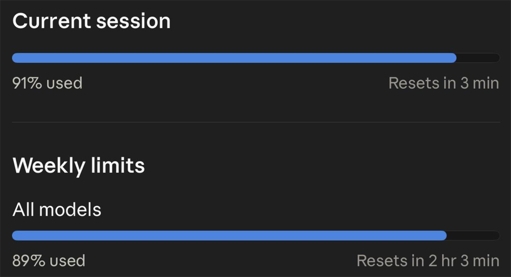
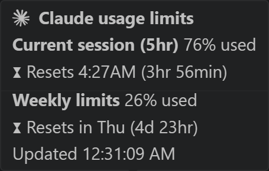
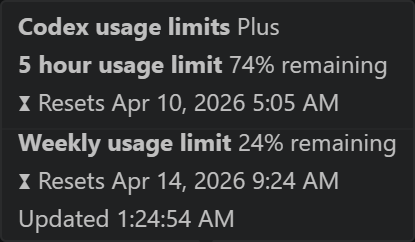
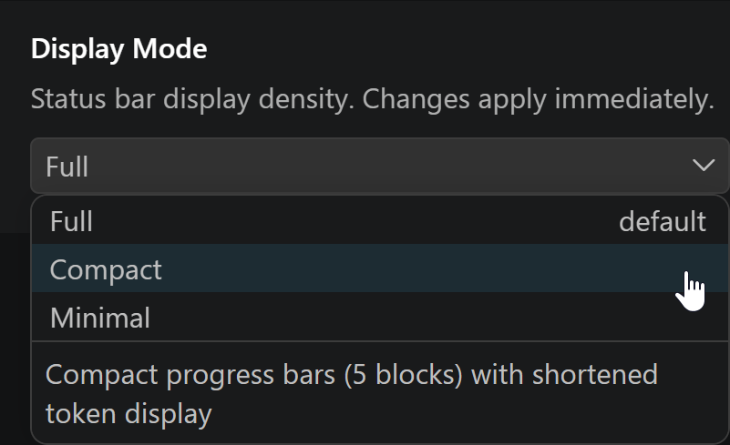
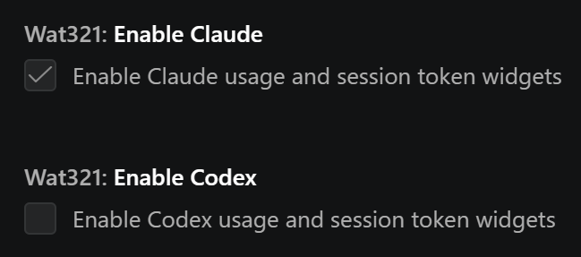
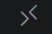
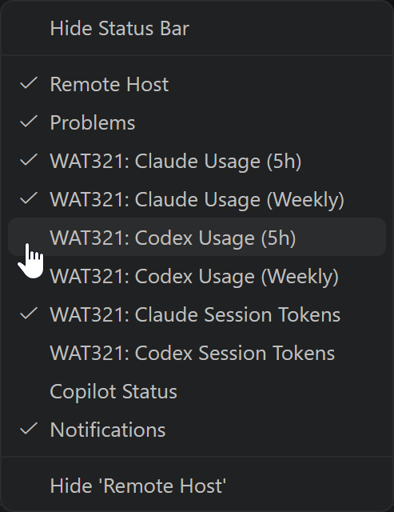

# WAT321 - Willy's AI Tools

### *Does manually refreshing AI usage limits give you anxiety?*

## Now you can live in fear in real-time!

Real-time AI usage widgets for your VS Code status bar.

WAT321 ships with **six read-only widgets** - three for Claude, three for Codex - all enabled out of the box. They only read your existing CLI files and poll a safe stats endpoint; they never modify anything. WAT321 only shows widgets for the providers you actually use, so a Claude-only or Codex-only setup just works with nothing to configure. If you add the other provider later, its widgets show up automatically.

One opt-in **Experimental** setting is also available in the Claude section - see below.

---

## What's Included

### Claude Usage

Live progress bars showing your 5-hour session utilization and weekly limits. Simple hover for information breakdown.

### Claude Session Tokens

Tracks your active Claude Code session's context window usage against the auto-compact ceiling. See how much room you have before compaction kicks in.

### Codex Usage

Same concept, **green** bars for Codex. Shows **remaining** capacity - the bars deplete as you use more.

### Codex Session Tokens

Monitors your Codex session's context window fill level. Same layout as Claude session tokens.

### Force Claude Auto-Compact *(experimental, off by default)*

An **experimental** checkbox in the Claude settings section. Arms Claude's Auto-Compact for your next message prompt to Claude. Triggers Auto-Compact on next prompt. Produces a higher-quality compaction result than the manual `/compact` command, preserving tool results and reasoning. This is the only WAT321 tool that writes outside `~/.wat321/`. Your Claude settings are backed up automatically each time the tool is armed. Useful for long sessions when performance degrades.

---

## Display Modes

WAT321 supports four display densities. Search **"wat321"** in **Settings** and pick the one that fits how crowded you like your status bar.

- **Auto** (default) - automatically picks Full when only one provider is active, Compact when both are active
- **Full** - 10-block progress bars with all details
- **Compact** - 5-block progress bars, session tokens show text only
- **Minimal** - text-only, usage bars move to tooltips on hover

---

## Installation

### From the VS Code Marketplace
1. Open VS Code
2. Go to Extensions (`Ctrl+Shift+X` / `Cmd+Shift+X`)
3. Search **"WAT321"**
4. Click **Install**

### From the Open VSX Registry
For VS Code forks and derivatives that use Open VSX instead of the proprietary Marketplace (VSCodium, Cursor, Windsurf, Gitpod, etc.):
1. Open the Extensions view in your editor
2. Search **"WAT321"**
3. Click **Install**

### From a .vsix file
1. `Ctrl+Shift+P` / `Cmd+Shift+P` then **Extensions: Install from VSIX**
2. Select the `.vsix` file
3. Reload window

**Where to find the files:**
- **.vsix downloads** - every release is attached to its [GitHub Release](https://github.com/WillyDrucker/WAT321/releases) as a downloadable asset
- **Open VSX listing** - *(coming soon - link to be added once the extension is published to Open VSX)*

---

## Provider Toggles

Both Claude and Codex widgets are enabled by default. If a provider CLI is not installed, its widgets stay hidden automatically, so you never end up with "Not Connected" clutter. If you want to turn one provider off yourself:

1. **File > Preferences > Settings** (`Ctrl+,` / `Cmd+,`) and search for **"wat321"**
2. Uncheck **Enable Claude** or **Enable Codex** - widgets disappear immediately, no reload needed

## Customize Visible Widgets

You can show or hide individual widgets by right-clicking the status bar or using the overflow menu (`>>`):

---

## How It Works

### The six read-only widgets (the default core)
- **Claude Usage** and **Codex Usage** poll their respective APIs on a safe interval (~2 minutes) with built-in rate-limit protection
- **Session Tokens** (both providers) read local transcript files - no API calls, no network access
- All six core widgets are **strictly read-only** - they never modify Claude, Codex, or user config files. Everything they write is a disposable cache inside WAT321's own folder
- **Hidden when a provider isn't set up yet** - if Claude or Codex isn't installed on your machine, those widgets stay out of the way. They appear automatically as soon as the provider is ready, no reload or restart needed
- Settings changes (enable/disable, display mode) take effect immediately - no window reload needed

### The experimental setting
- **Force Claude Auto-Compact** touches one setting in `~/.claude/settings.json` to trigger Claude's built-in auto-compact, then restores the original value automatically. Default off, lives under an **Experimental** label in the Claude settings section

## What It Doesn't Do

- **Will not affect your usage limits.** Usage widgets poll a read-only stats endpoint on a safe interval. Session token widgets only read local files - no API calls, no network access. Nothing WAT321 does counts toward your Claude or Codex usage. *The experimental Force Claude Auto-Compact setting is the one exception and is off by default.*
- **Does not store, transmit, or modify your credentials.** Anything WAT321 saves locally is disposable and can be cleared at any time from the settings page.
- **Does not interfere with Claude Code, Codex CLI, or any other extension.**
- **The six core widgets never modify user files.** They only read. The experimental Force Claude Auto-Compact setting is the single exception, described above.

## Requirements

- VS Code 1.85.0 or later
- Claude widgets need an active Claude account with CLI credentials (`~/.claude/.credentials.json`)
- Codex widgets need Codex CLI credentials (`~/.codex/auth.json`)
- Session token widgets need an active session in the respective CLI tool

## Supported Plans

| Provider | Plan | Status |
|----------|------|--------|
| Claude | Max (5x / 10x / 20x) | Supported - plan tier detected automatically |
| Claude | Pro | Supported - usage data works, plan label not shown |
| Claude | Free | Supported - usage data works, plan label not shown |
| Claude | Team / Enterprise | Unknown - untested with the usage API |
| Codex | Plus / Pro / Team | Supported |

API-only Anthropic accounts without CLI OAuth credentials will see Claude widgets stay hidden until CLI credentials are set up.

## Rate Limits

Both Claude and Codex usage APIs have rate limits. WAT321 polls conservatively to stay well within safe thresholds. However, **repeatedly reinstalling or reloading the extension in quick succession can trigger a temporary rate-limit lockout**.

If a lockout occurs, the status bar will show "Offline" and the tooltip will display a countdown timer. The extension will automatically reconnect when the lockout expires - no action needed.

## Additional Settings

- **Status Bar Priority** - Adjust widget ordering if they overlap with other extensions (requires window reload).

## Reset WAT321

Need a clean slate? Open the command palette (`Ctrl+Shift+P` / `Cmd+Shift+P`) and run **WAT321: Reset All Settings**, or check the **Reset WAT321** box at the bottom of the WAT321 settings page. That restores WAT321 to its defaults and clears its saved local data. If any WAT321 tool ever appears unresponsive, this also resets every tool back to a known-good state. No restart needed.

## Issues & Feedback

Found a bug or have a feature request? [Open an issue on GitHub](https://github.com/WillyDrucker/WAT321/issues).

## License

[MIT](LICENSE)
