# WAT321 - Willy's AI Tools

### *Does manually refreshing AI usage limits give you anxiety?*

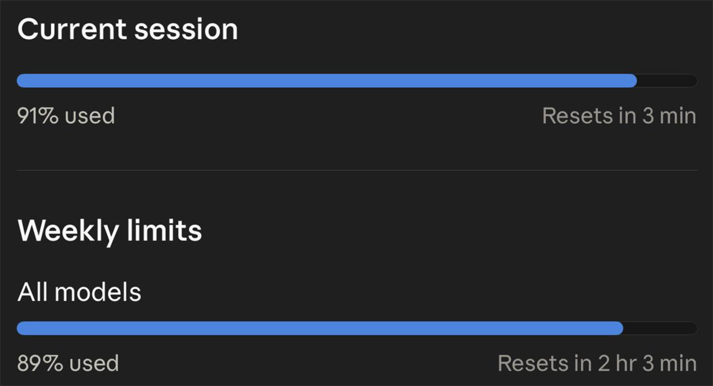

## Now you can live in fear in real-time!

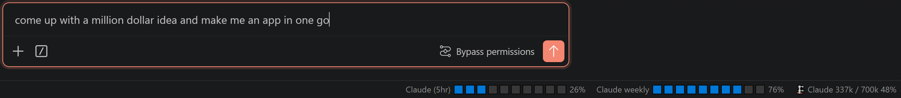

Claude and Codex usage bars built right into your IDE.

WAT321 ships with **six read-only widgets** - three for Claude, three for Codex - all enabled out of the box. They only read your existing CLI files and poll a safe stats endpoint; they never modify anything.

- 4 usage limit progress bars (Claude + Codex, 5-hour and weekly)
- 2 real-time session token status bars with a live activity indicator
- System notifications when a response finishes - never miss a reply while tabbed away
- Heatmap for progress bars - colors warn as limits approach
- Epic Handshake (experimental) - ask Codex from inside any Claude session through a small local bridge
- Model Bridge (experimental) - point Claude at any OpenAI-compatible LLM (local llama.cpp / Ollama / vLLM, or cloud OpenCode Zen routes like Big Pickle / GPT 5 Nano / Ling / etc.) for a second opinion without spending Claude tokens
- Available on the VS Marketplace, Open VSX Registry, and as a direct `.vsix` download

---

## What's Included

### Claude Usage

Live progress bars showing your 5-hour session utilization and weekly limits.

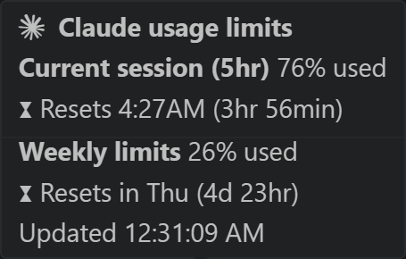 
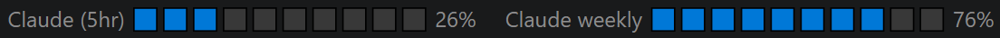

### Claude Session Tokens

Real-time token count for your active Claude Code session so you can see where you stand without running any commands. Tooltip has the detailed breakdown.

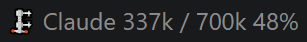 

### Codex Usage

Same concept, **green** bars for Codex. Shows **remaining** capacity - the bars deplete as you use more.

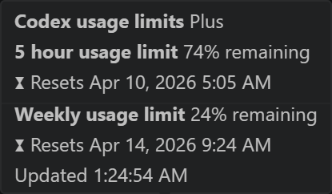 
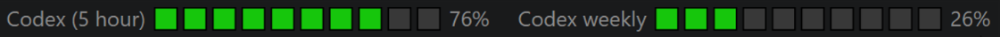

### Codex Session Tokens

Real-time token count for your active Codex session. Same layout and activity indicator as Claude session tokens.

### Notifications

Get notified when Claude or Codex finishes a response. Works on Windows, Linux, and macOS.

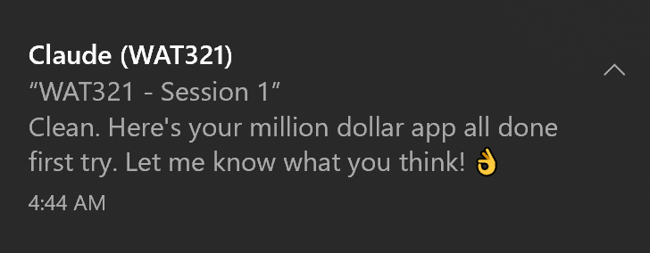

### Epic Handshake *(experimental, off by default)*

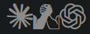

Lets you say things like *"Ask Codex to review this..."* using natural language in any Claude session and have Codex actually answer! Think of it like a subagent on performance-enhancing code. Both the Claude and Codex widgets must be enabled. *Handy for offloading token usage.*

### Model Bridge *(experimental, off by default)*

Point Claude at any OpenAI-compatible LLM and Claude gains a fleet of MCP tools to consult it. Local servers (llama.cpp, Ollama, vLLM, LM Studio) and cloud routes (OpenCode Zen's free `big-pickle`, `gpt-5-nano`, `ling-2.6-flash`, `hy3-preview-free`, `nemotron-3-super-free`, `minimax-m2.5-free`) configure as instances in the same array; the click menu picks which one is active. Say *"Ask Gemma what she thinks of this code"* or *"Have Big Pickle take a swing at this"* and Claude calls the right endpoint - the reply lands in the conversation alongside Claude's own answer, no Claude tokens consumed for the model's work. Reasoning models that return their thinking trace separately have it surfaced and tagged so Claude can see both the answer and the reasoning. Every reply ends with a `[retention]` banner so you (and Claude) never lose track of where the prompt went.

The bridge streams replies via Server-Sent Events, so the status-bar widget shows live token rate while the model generates (`Big Pickle 247t @ 32/s`). For long calls, pass `async: true` to `model_bridge_ask` and the tool returns a request id immediately - the call runs in the background and `model_bridge_inbox` retrieves the result when you're ready.

For multi-turn conversations, `model_bridge_thread` keeps a persistent rollout per conversation pinned to its starting instance - every turn replays history so the model has memory, and auto-compact triggers at 85% of the context window so long sessions don't overflow. Sub-actions: `start`, `ask`, `resume`, `list`, `end`, `compact`. Reply footers show running context usage so you can see fill grow turn over turn.

The Phased Model Protocol surfaces what the model is *doing* during a call, not just how long it's been doing it. The model emits `<<PHASE:STARTED>>` / `<<PHASE:HALFWAY:summary="..."` / `<<PHASE:COMPLETING>>` markers, the bridge strips them from the visible reply, and the widget shows the current phase plus a hover tooltip with the full phase trace. The HALFWAY summary is the steering anchor - Claude can redirect on the next turn rather than waiting for a full wrong answer. Mostly useful with local models; cloud routes tend to ignore the marker scaffolding.

Click the Model Bridge widget for a menu: pick the active instance, open the output channel, test the connection (probes `/v1/models` against the active endpoint), manage threads (list, end, or erase), tune sampling / timeout / system prompt, toggle phased protocol, set the OpenCode Zen API key. Configuration is per-call atomic, so changes take effect on Claude's very next call without a restart.

For tool-using tasks (read/write code, fetch URLs, run shell commands) the bridge can delegate to an external harness - currently OpenCode by SST. Toggle the OpenCode harness from the Model Bridge click menu, run `opencode serve --hostname 0.0.0.0 --port 4096` on whichever box you want OpenCode to live on (your dev machine if you want it operating on your VS Code workspace, or the LLM box for scrape/process tasks), and WAT321 talks to it over plain HTTP - no SSH, no spawning child processes. The server URL auto-derives from the active local instance's endpoint host using OpenCode's default port 4096; override via the click menu if needed. Once reachable, `model_bridge_task` becomes available; Claude hands it a prompt, OpenCode drives the tool loop end-to-end, and Claude only sees the final result. The harness only routes to `kind: local` instances - cloud instances cannot drive the local OpenCode binary.

OpenCode Zen API keys live in VS Code's SecretStorage, encrypted at rest via the OS keychain - never in `settings.json`. Run `WAT321: Model Bridge - Set OpenCode Zen API Key` (also reachable from the click menu) to populate; one key, all six free Zen instances share it. Cleared on Reset WAT321.

Settings.json carries only identity (`wat321.modelBridge.enabled`, `wat321.modelBridge.instances`, `wat321.modelBridge.useOpenCodeHarness`). Everything tunable per task - active instance id, temperature, max tokens, timeout, system prompt, phased protocol toggle, auto-compact threshold, OpenCode server URL - lives in the click menu and persists to `~/.wat321/model-bridge/preferences.json`.

---

## Installation

### From the VS Code Marketplace or Open VSX Registry

1. Open VS Code (or a fork like VSCodium, Cursor, Windsurf, Gitpod - these pull from Open VSX)
2. Go to Extensions (`Ctrl+Shift+X` / `Cmd+Shift+X`)
3. Search **"WAT321"**
4. Click **Install**

### From a .vsix file
1. `Ctrl+Shift+P` / `Cmd+Shift+P` then **Extensions: Install from VSIX**
2. Select the `.vsix` file
3. Reload window

**Where to find the files:**
- **VS Marketplace** - https://marketplace.visualstudio.com/publishers/WillyDrucker
- **Open VSX Registry** - https://open-vsx.org/extension/WillyDrucker/wat321
- **.vsix downloads** - every release is attached to its [GitHub Release](https://github.com/WillyDrucker/WAT321/releases) as a downloadable asset

---

## Provider Toggles

Claude and Codex widgets are both on by default. If a provider's CLI isn't installed, its widgets stay hidden automatically. To turn one off manually, open **Settings** (`Ctrl+,` / `Cmd+,`), search **"wat321"**, and uncheck **Enable Claude** or **Enable Codex** - widgets disappear immediately, no reload needed.

 
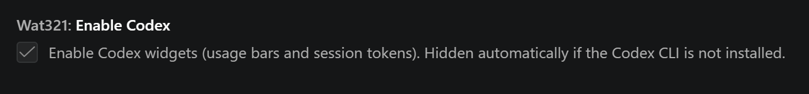

## Display Modes

WAT321 supports four display densities. Search **"wat321"** in **Settings** and pick the one that fits how crowded you like your status bar.

- **Auto** (default) - automatically picks Full when only one provider is active, Compact when both are active
- **Full** - 10-block progress bars with all details
- **Compact** - 5-block progress bars, session tokens show text only
- **Minimal** - text-only, usage bars move to tooltips on hover

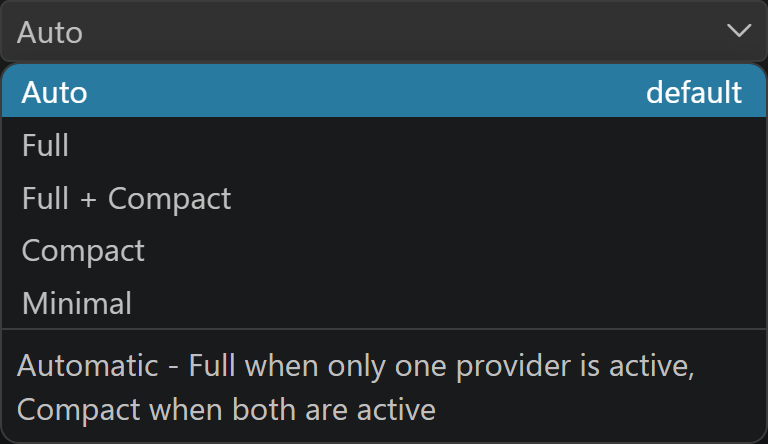

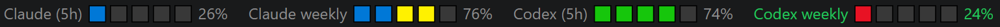

## Customize Visible Widgets

You can show or hide individual widgets by right-clicking the status bar or using the overflow menu (`>>`):

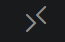

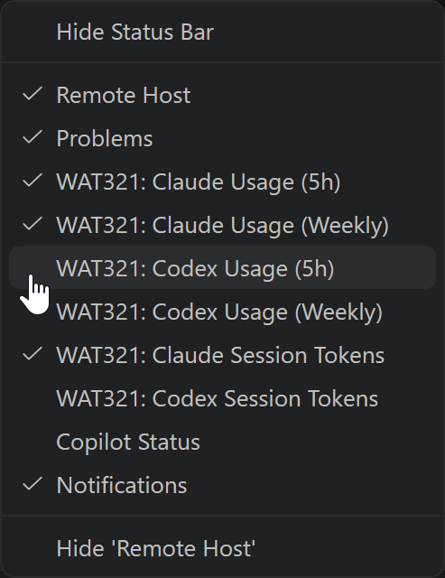

---

## How It Works

- **Claude Usage / Codex Usage** poll each provider's stats endpoint on a safe interval (~2 minutes) with rate-limit protection.
- **Session Tokens** read local CLI files only - no API calls, no network. Yellow `LOAD` flashes during deliberate cache rebuilds (`/compact` or reload); red `MISS` is reserved for unexpected eviction.
- Everything WAT321 writes is a disposable cache inside `~/.wat321/`. Settings changes take effect immediately with no reload.
- **Epic Handshake** adds a widget between the Claude and Codex session token bars. Click it to retrieve late replies, switch wait mode, change Codex defaults (sandbox / model / effort), or restart the bridge. Full settings live under **Epic Handshake (Claude to Codex Only)**.
- **Model Bridge** registers a `wat321-model-bridge` MCP server with Claude Code (separate from Epic Handshake's `wat321` server) exposing five tools: `model_bridge_ask`, `model_bridge_thread`, `model_bridge_inbox`, `model_bridge_list`, and (when the OpenCode harness is enabled, the active instance is local, AND OpenCode is reachable) `model_bridge_task`. The extension writes a merged config file atomically combining `wat321.modelBridge.instances` with `~/.wat321/model-bridge/preferences.json` and resolved API keys from VS Code's SecretStorage; the MCP server reads it per call. Status-bar widget watches a heartbeat file written during requests; click for a menu that picks the active instance and drives runtime tuning.

## What It Doesn't Do

- **Core tools will not affect your usage limits.** Usage widgets poll a read-only stats endpoint. Session token widgets only read local files.
- **Does not store, transmit, or modify your credentials.** Anything WAT321 saves locally is disposable and can be cleared at any time from the settings page.
- **Does not interfere with Claude Code, Codex CLI, or any other extension.**

## Requirements

- VS Code 1.100.0 or later
- Claude widgets need an active Claude account with CLI credentials (`~/.claude/.credentials.json`)
- Codex widgets need Codex CLI credentials (`~/.codex/auth.json`)
- Session token widgets need an active session in the respective CLI tool
- Epic Handshake needs both the Claude Code and Codex installed and signed in.
- Model Bridge needs Claude Code installed and at least one OpenAI-compatible chat endpoint reachable - either local (a llama.cpp `--jinja` server, Ollama, vLLM, or LM Studio on your network) or remote (an OpenCode Zen account with an API key from https://opencode.ai/).

## Supported Plans

| Provider | Plan | Status |
|----------|------|--------|
| Claude | Max (5x / 10x / 20x) | Supported - plan tier detected automatically |
| Claude | Pro / Free | Supported - usage data works, plan label not shown |
| Claude | Team / Enterprise | Untested - see Known Issues |
| Codex | Plus / Pro / Team | Supported |

## Additional Settings

- **Notifications** - System notifications when a response completes. On by default. Choose Off, Auto, System Notifications, or In-App. Filter by provider.
- **Enable Heatmap** - Colors progress bars as you approach your limits. On by default. Turn off for plain solid bars.
- **Status Bar Priority** - Adjust widget ordering if WAT321 overlaps with other extensions in the status bar. Requires window reload.

## Reset WAT321

Need a clean slate? Open the command palette (`Ctrl+Shift+P` / `Cmd+Shift+P`) and run **WAT321: Reset WAT321**, or check the **Reset WAT321** box at the bottom of the WAT321 settings page. This restores WAT321 to its defaults and clears everything it has stored locally. If any WAT321 tool appears unresponsive, this will reset all to a known-good state. A confirmation dialog will appear before resetting.

## Known Issues

A few rough edges that are worth knowing about. None of them need any action on your part - they either self-heal or are waiting on upstream fixes.

- **Claude Max plan tier label can lag.** Upgrades (for example Max 5x to Max 20x) may take a billing cycle to reflect. Actual limits are still correct.
- **"Idle" means the usage endpoint throttled a cold poll.** Clears on Claude's next activity - no countdown, no wait. "Offline" with a countdown is a real rate limit and reconnects automatically.
- **API-only Anthropic accounts stay hidden.** Claude widgets need CLI credentials at `~/.claude/.credentials.json`.
- **Team and Enterprise Claude plans are untested.** Should work; open an issue if something looks off.

## Issues & Feedback

Found a bug or have a feature request? [Open an issue on GitHub](https://github.com/WillyDrucker/WAT321/issues).

## License

[MIT](LICENSE)
